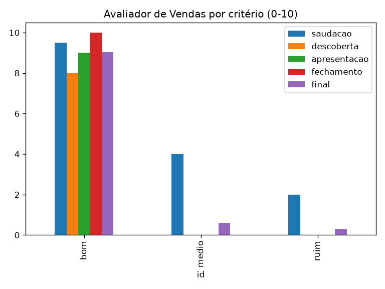

# Avaliador de Vendas com IA

[](https://github.com/fcervan/avaliador-vendas/actions)
[](https://www.python.org/)
[](tests/)
[](LICENSE)
[](https://colab.research.google.com/github/fcervan/avaliador-vendas/blob/main/notebooks/02_uso_colab.ipynb)

Avalia automaticamente se um atendimento de vendas seguiu o script comercial, a partir da
transcrição da conversa. Para cada atendimento, o sistema dá **nota de 0 a 10 por etapa**,
**nota final ponderada**, **veredito** (aprovado / atenção / reprovado) e **feedback textual**
do que funcionou e do que precisa melhorar.

Útil para gestores comerciais e times de qualidade que precisam auditar muitos atendimentos
com critério consistente — sem ouvir ligação por ligação.

## Demonstração

Resultado real de uma execução sobre 3 transcrições de exemplo (`data/exemplos.csv`):

| Atendimento | Saudação | Descoberta | Apresentação | Fechamento | Final | Veredito |
|---|---|---|---|---|---|---|
| bom | 9.5 | 8.0 | 9.0 | 10.0 | 9.03 | aprovado |
| medio | 4.0 | 0.0 | 0.0 | 0.0 | 0.60 | reprovado |
| ruim | 2.0 | 0.0 | 0.0 | 0.0 | 0.30 | reprovado |



Note que os casos reprovados param na primeira etapa: é o **early-exit** — se a base
(saudação/rapport) falha, o sistema não gasta avaliação nas etapas seguintes.

## Como funciona

Quatro avaliadores LLM-as-judge (um por etapa do script), orquestrados em grafo LangGraph
com saída antecipada e média ponderada:

```
saudação (>0.5?) → descoberta (>0.5?) → apresentação (>0.5?) → fechamento → nota final
       │                 │                      │                   │
       └──────── early-exit: nota baixa encerra aqui ──────────────┘
```

| Etapa | Peso | O que é avaliado |
|---|---|---|
| Saudação / rapport | 0.15 | Cumprimenta, se apresenta, cria conexão |
| Descoberta | 0.30 | Perguntas sobre necessidade, dor, orçamento, decisor, prazo |
| Apresentação | 0.30 | Conecta a solução à dor, benefício antes de feature, contorna objeção |
| Fechamento / CTA | 0.25 | Resume o valor, propõe próximo passo com prazo |

Veredito: `≥ 7 aprovado` · `5–7 atenção` · `< 5 reprovado`. Sem mascaramento de dados
pessoais nesta versão.

O provedor de LLM tem fallback automático **Groq → Ollama Cloud → OpenRouter**
(Groq primeiro, por menor latência). Basta uma das três chaves.

## Uso rápido

**No Colab (1 clique, recomendado para iniciantes):** abra o botão *Abrir no Colab* acima,
dê *Tempo de execução → Executar tudo* e cole sua chave quando pedido (digitação oculta,
nada é salvo no repositório).

**Local com notebook didático:**

```bash
pip install -r requirements.txt
cp .env.example .env  # preencher GROQ_API_KEY (nunca versionar o .env)
jupyter notebook notebooks/01_avaliador_vendas.ipynb
```

**Local em lote (seu dataset):**

```bash
python run_local.py --csv data/exemplos.csv --out resultados.csv
python run_local.py --csv meu_dataset.csv --col transcricao --out saidas/rodada1.csv --limit 3
```

O CSV de entrada segue o formato de `data/exemplos.csv` (`id,nivel,transcricao`).
A saída traz notas por critério, nota final, veredito e feedbacks.

## Estrutura

```
avaliador-vendas/
├── notebooks/01_avaliador_vendas.ipynb  # didático: aprenda executando
├── notebooks/02_uso_colab.ipynb         # zero-fricção para o Colab
├── src/                                 # código modular
│   ├── llm_client.py                    # fallback Groq → Ollama → OpenRouter
│   ├── schemas.py                       # estado + pesos + veredito
│   ├── rubrics.py                       # rubrica das 4 etapas
│   ├── evaluators.py                    # 4 nós LLM-as-judge + nota final
│   └── graph.py                         # StateGraph com early-exit
├── run_local.py                         # avaliação em lote via CLI
├── data/exemplos.csv                    # transcrições bom/médio/ruim
├── meu_dataset.csv                      # exemplo de dataset próprio
└── tests/                               # suíte mockada (sem custo de API)
```

## Qualidade

* **28 testes automatizados**, todos mockados (nenhum chama a API de verdade)
* **100% de cobertura** de `src/` + `run_local.py` (exigido em `pyproject.toml`)
* Lint e formatação com **Ruff**
* Pipeline **GitHub Actions** a cada push/PR: lint → formato → testes + cobertura

```bash
pip install -r requirements-dev.txt
ruff check src tests run_local.py && ruff format --check src tests run_local.py
pytest tests/ -q --cov --cov-report=term-missing
```

## Créditos e origem

Projeto derivado do notebook
[avaliador_de_redacao.ipynb](https://github.com/Scoras-Academy/Projetos_Praticos_de_IA/blob/main/Projetos_praticos_de_IA/avaliador_de_redacao.ipynb)
do módulo Projetos Práticos de IA da **Scoras Academy** (prof. **Anderson Amaral**).
A base (rubrica + LLM-as-judge + LangGraph condicional + early-exit + média ponderada)
vem de lá; aqui ela foi adaptada para avaliação de vendas e evoluída com fallback
multi-LLM, CLI em lote, suíte de testes com 100% de cobertura e CI.

## Roadmap

* Mascaramento de dados pessoais (LGPD) antes da avaliação
* Novas rubricas no mesmo molde: suporte/CS, entrevista RH, pitch comercial, reunião/ata,
  chatbot/RAG, code review, compliance LGPD, aula didática, copy de e-mail
